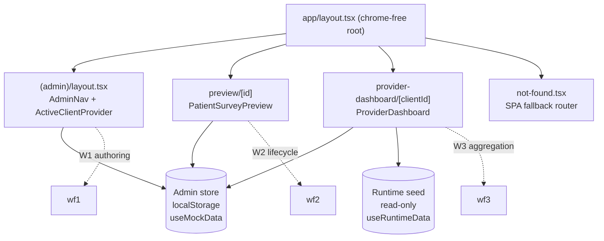
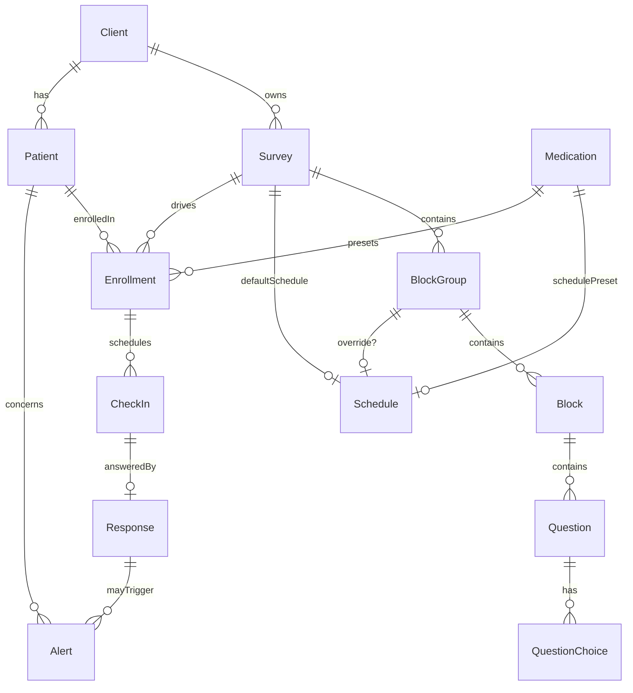
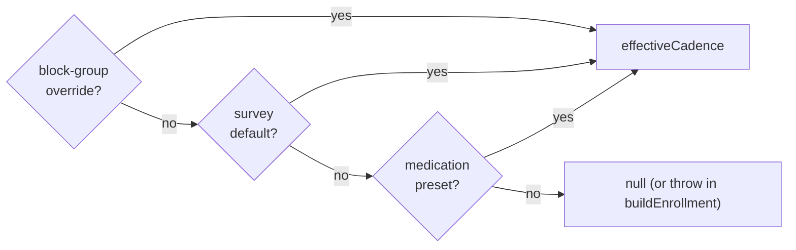
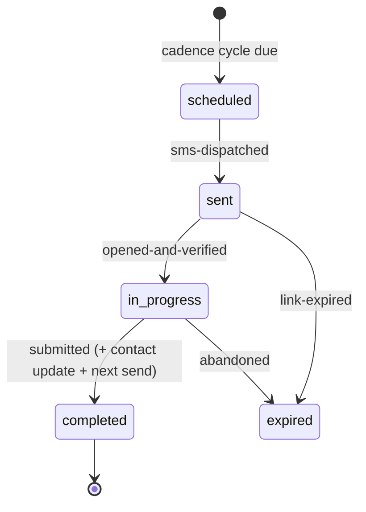

<!--DOC00001:APP&DT-->
## Architecture overview

A **demo** for Effective's patient-medication check-in platform — a Next.js App
Router app with **no backend, auth, or live engine**. All data is in-memory /
`localStorage` mock data; all "engine" behaviour (scheduling, lifecycle,
scoring) is pure functions invoked for authoring/preview only.

> **Non-standard Next.js.** Per `demo/AGENTS.md`, this repo pins a Next.js whose
> APIs differ from training data — notably **route `params` are Promises**
> (`Next.js 16`); page components `await params`. Read `node_modules/next/dist/docs/`
> before editing route files.

Static-exported to **GitHub Pages** (`next.config.ts` `basePath: /health-survey`).
Seeded routes are prebuilt via `generateStaticParams` + `export const dynamicParams = false`;
session-created entities (random ids in `localStorage`) have no prebuilt page, so
GitHub Pages serves `404.html` (built from `app/not-found.tsx`), which re-dispatches
on `window.location.pathname` to render the matching view client-side (SPA fallback).

**Three route trees** under one chrome-free root layout (`app/layout.tsx`):
- `app/(admin)/` — Workflow 1 (admin authoring), wrapped in `(admin)/layout.tsx`
  chrome (brand header + `AdminNav` sidebar + `ActiveClientProvider`). `app/page.tsx` redirects `/` → `/dashboard`.
- `app/preview/[id]/` — Workflow 2 surface: patient-facing survey walkthrough, chrome-free.
- `app/provider-dashboard/[clientId]/` — Workflow 3: read-only provider dashboard, chrome-free.

**Two stores / two hooks** (DOC00009): `useMockData()` → `localStorage`-backed Admin
store (`MockData`); `useRuntimeData()` → read-only static seed clone (`RuntimeMockData`).

<!--/DOC00001:APP&DT-->

<!--DOC00002:DT-->
## Domain model (`types/domain.ts`)

THE domain model. Two top-level datasets, kept separate:
- `MockData` (558-568): `clients`, `surveys`, `blockLibrary`, `medications` — the Admin store.
- `RuntimeMockData` (583-589): `patients`, `enrollments`, `checkIns`, `responses`, `alerts` — the read-only dashboard runtime entities (REQ00006: not modeled by the Admin platform).

**Survey content is HIERARCHICAL**: `Survey → BlockGroup → Block → Question → QuestionChoice`.
- `Survey` (244-266): owns `clientId`, `status` (`draft|published|archived`, 59), `baseLanguage`, `defaultSchedule`, `blockGroups: BlockGroup[]`.
- `BlockGroup` (224-237): `name`, `order`, optional `schedule?` (override), `blocks[]`. Canonical layer between Survey and Block so parts of one survey recur on different intervals.
- `Block` (122-134): `name`, `order`, optional `inclusion?: BlockInclusion` (`initial|recurring|always`, default `always`, 108-116), `questions[]`.
- `Question` (92-106): `type` (`single-select|multi-select|text|date`, 62), `required`, `choices`, optional `displayCondition?: DisplayCondition` (81-86: gateway `questionId` + `choiceId` branching).
- `QuestionChoice` (65-70): `label` + numeric `scoreCode`.

**Schedule layers** (155-185): `Schedule { every, unit (days|weeks|months), firstSendOffsetDays, scope }`. `ScheduleScope` = `survey-default | block-group-override | medication-preset` — three cadence layers (see DOC00003). `Medication` (198-209): `type` → `schedulePreset` (lowest layer).

**Runtime entities**: `Patient` (358-377, per-client `clientId`; optional dashboard fields `email`/`dateOfBirth`/`demographics`/`language`), `Enrollment` (294-318, carries resolved `effectiveCadence` + optional `blockGroupId`), `CheckIn` (412-433, lifecycle `status`), `Response` (441-459, `adherenceScore` lower-is-better + `freeText`), `Alert` (483-496, read-only). Library: `LibraryBlock`/`LibraryQuestion` (504-511). Preview-only: `TestResponse` family (527-552).

<!--/DOC00002:DT-->

<!--DOC00003:LIB&DT-->
## Effective-cadence resolution (`lib/scheduling.ts`)

The ONE canonical place resolving the layered cadence. Pure functions; computed
during render. `DEFAULT_SURVEY_SCHEDULE` (35-40) = weekly/same-day, scope `survey-default`.

Resolution precedence — **highest present layer wins**, medication preset is the lowest fallback:
1. block-group override → 2. survey default → 3. medication preset.

Key functions:
- `resolveEffectiveCadence(survey, group)` (81-89) → `{schedule, source}` for one group: group's own `schedule` overrides, else inherits survey default.
- `medicationPresetFor(medications, type)` (109-118) → `Schedule | null`; case-insensitive trimmed `type` lookup (the type→preset attachment, NOT the full resolution).
- `resolveEnrollmentCadence(layers: CadenceLayers)` (171-187) → applies the 3-layer precedence; returns `null` when no layer present (expected miss as value).
- `resolveEnrollmentEffectiveCadence(input, survey, medication)` (209-239) → gathers candidate layers (reuses `resolveEffectiveCadence` + `medicationPreset`) and resolves.
- `buildEnrollment(id, input, survey, medication)` (262-275) → fully-resolved `Enrollment` with `effectiveCadence` set; **throws** when no layer at all (unexpected).
- Display formatters: `formatInterval`/`formatFirstSend`/`formatSchedule` (290-320).
- Ordering/flattening (canonical, non-mutating): `orderedBlockGroups` (331-333), `orderedBlocks` (343-345), `flattenBlocks(survey)` (357-359, group-then-block order) — the adapter for flat-list consumers (list counts, test-response gen, preview).

The block-group layer is **provisional** (DOM00032): collapses by simply not supplying `blockGroupOverride` — no resolver change needed.

<!--/DOC00003:LIB&DT-->

<!--DOC00004:LIB&DT-->
## Flow logic (`lib/flow-logic.ts`)

Pure conditional-rendering helpers; degrade safely to "always show" on
legacy/malformed data. Consumed by the patient preview (DOC00007).
- `RunMode` = `initial | recurring`.
- `resolveInclusion(block)` (36-42) → block's `inclusion`, defaulting unset/unknown to `always`.
- `isBlockIncluded(block, mode)` (52-55) → `always` blocks run on both modes; `initial`/`recurring` only on the matching mode.
- `isQuestionVisible(question, selectedChoiceIds)` (67-76) → no `displayCondition` ⇒ always visible; gated question visible only once its gateway `choiceId` is in the selected set. A condition pointing at a missing gateway never hides (the choiceId simply is not selected).
<!--/DOC00004:LIB&DT-->

<!--DOC00005:LIB&DT-->
## Check-in lifecycle (`lib/checkin-lifecycle.ts`) — Workflow 2

The per-patient cadence lifecycle as **pure state transitions** over `CheckIn`
(no live scheduler/SMS). Consumes the enrollment's already-resolved
`effectiveCadence` — never re-resolves the layers.

Error model: illegal transitions are **expected** failures returned as
`TransitionResult` values (`{ok:false, reason: 'invalid-state'|'link-expired'}`),
not thrown. `TRANSITIONS` table (75-84) is the single source of truth for legal edges.

Functions: `scheduleCheckIn(enrollment)` (135-143, the `[*]→scheduled` entry edge,
mints `link`), `dispatchCheckInSms(checkIn, patient, send, now?, activeDays?)`
(187-205, → `sent`, sets `sentAt`/`expiresAt`, calls injected `SmsSender` port —
**not Twilio-locked**; demo uses `noopSmsSender`), `openCheckIn` (240-248, → `in-progress`,
rejects expired link), `expireCheckIn` (274-282, `sent|in-progress` → `expired`),
`isLinkExpired` (258-263), `receiveResponse(...)` (319-360, → `completed`: records
`Response`, **updates `Patient` contact** from confirmed contact, schedules the next
check-in), `isCadenceCycleDue(enrollment, lastSentAt, now?)` (374-387; stopped
enrollment never due; `null` lastSentAt always due). `buildCheckInLink` (115-117),
`addInterval` (months ≈ 30 days, 87-105).

<!--/DOC00005:LIB&DT-->

<!--DOC00006:ADM&CMP&HK-->
## Admin surface — Workflow 1 (`app/(admin)/`)

All admin pages are `'use client'` (no `generateStaticParams`) except the
`[id]` detail/edit pages which prebuild via `SEED_SURVEYS`/`SEED_CLIENTS`.
`(admin)/layout.tsx` wraps everything in `ActiveClientProvider` + chrome; nav is
`_components/admin-nav.tsx`.

**Active client context** (`hooks/active-client.tsx`): `localStorage`-backed
(`useSyncExternalStore`, SSR snapshot `null`), key `health-survey-demo:active-client:v1`,
sentinel `ALL_CLIENTS`. The single "which client am I working within" source —
filters the surveys list, defaults the new-survey builder. `useActiveClient()` throws outside the provider.

**Routes**: `dashboard/` (landing), `clients/` (list of `ClientCard`s — each links to
edit + **"View provider dashboard ↗"** → `/provider-dashboard/<id>`, client-card.tsx:68-73),
`clients/new/` (`ClientForm`), `clients/[id]/edit/` (`EditClientForm`), `surveys/`
(`SurveysList` filtered by active client + `ClientSelector`), `surveys/new/` &
`surveys/[id]/edit/` (both render `SurveyBuilder`), `surveys/[id]/` (DOC00007),
`library/` (`LibraryManager`).

**SurveyBuilder** (`surveys/new/_components/survey-builder.tsx`, 933 lines): assembles
`Survey → BlockGroup → Block → Question`. Materialises library blocks via
`instantiateBlock` (fresh ids so the survey owns content independently), edits via
`QuestionEditor`, sets survey default schedule + optional per-group override (inline
in the survey input), previews effective cadence via `resolveEffectiveCadence`. Save:
`addSurvey(input)` → `/surveys`, or with `editSurveyId` `updateSurvey(id, input)` →
`/surveys/<id>` (385-389). Reused by `not-found.tsx` for the SPA edit fallback.

**Components**: `QuestionEditor` (`components/question-editor.tsx`, type picker, choices+scoreCodes, gateway/display-condition picker — only choice-bearing questions are gateways), `client-form`/`edit-client-form` (CRUD via `addClient`/`updateClient`), `client-status-toggle` (`setClientStatus`), `LibraryManager` (`addLibraryBlock`/`updateLibraryBlock`/`removeLibraryBlock`), `BrandSwatches`, `StatusBadge`, `Badge`, `SearchInput`.
<!--/DOC00006:ADM&CMP&HK-->

<!--DOC00007:ADM&PREV&LIB-->
## Survey preview, test responses, QR, export

**Admin detail** (`surveys/[id]/_components/survey-detail.tsx`, 308): renders the
assembled survey as a respondent sees it (`SurveyPreview`, with owning client
branding), desktop/mobile toggle, lifecycle actions (`setSurveyStatus`,
`copySurvey`, `reopenSurvey`), QR (`SurveyQrPreview`), and "Generate test responses".

**Test responses** (`lib/mock/test-responses.ts`): `generateTestResponses(survey, mode)`
fabricates **3 deterministic** respondents (no `Math.random`) from the survey's own
flattened questions/choices/scoreCodes — stand-in for the real scoring engine. Modes:
`answer-all` (default) and `ignore-validation` (deterministically leaves some required
questions blank). Risk tier from summed score (≥6 high, ≥3 medium). Surfaced by
`TestResponsesPanel`.

**Export** (`lib/export/test-responses-export.ts`): `downloadTestResponses(responses, format, fileBaseName)`
— client-side `Blob` + object-URL download (no backend). Formats `csv` (RFC-4180-escaped,
per-question answers flattened to `"<q>: <a> (+<score>)"`) and `json`; no-ops on empty.

**QR** (`lib/qr/survey-url.ts`): `surveyCheckInUrl(surveyId)` (20-22) → deterministic
`https://demo.effective-health.example/c/<surveyId>` — **preview artifact only**,
never creates a check-in. Rendered as inline SVG (`qrcode.react`, no network) by `SurveyQrPreview`.

**Patient preview** (`preview/[id]/_components/patient-survey-preview.tsx`, 498):
the Workflow-2 patient-facing walkthrough at `/preview/[id]` (chrome-free, device-width
viewport). Resolves the survey from the mock store, applies client branding (neutral
`FALLBACK_BRANDING` when unresolved), runs an interactive step-through over the flattened
visible questions — fully functional for all 4 question types — using `isBlockIncluded`
(run-mode toggle) + `isQuestionVisible` (live branching from current answers) and
required-field gating. Page (`preview/[id]/page.tsx`) prebuilds seeded surveys; `not-found.tsx` covers session-created ones.
<!--/DOC00007:ADM&PREV&LIB-->

<!--DOC00008:PDASH&LIB&HK-->
## Provider dashboard — Workflow 3 (`app/provider-dashboard/[clientId]/`)

Standalone, chrome-free, read-only. Page (`page.tsx`) prebuilds seeded clients
(`SEED_CLIENTS`), awaits the `clientId` Promise → `ProviderDashboard`.

**`ProviderDashboard`** (`_components/provider-dashboard.tsx`, 184): reads BOTH stores —
`useMockData()` for the `Client` (branding) and `useRuntimeData()` for the population.
Applies the client's white-label branding (Effective's brand never appears). Three
explicit states: store hydrating (loading), unknown `clientId` (not found), resolved
client with no seeded rows (empty population — not an error). Selecting a patient swaps
the list for `PatientDrilldown` until dismissed.

**Aggregation** (`lib/dashboard-aggregation.ts`, pure):
- `aggregateClientPopulation(runtime, clientId)` (165-224) → `ClientPopulation`: scopes
  by `Patient.clientId`, walks `Patient→Enrollment→CheckIn→Response` (O(1) index maps),
  rolls each patient up into a `PatientSummary` (latest score, `riskBand`, alert count),
  sorts most-recently-active first, + by-category `PopulationSummary` (risk band /
  age band / gender; `patientsNeedingFollowUp`). `RiskBand` via `RISK_THRESHOLDS`
  (≥6 high, ≥3 medium; lower score is better).
- `buildPatientDetail(runtime, clientId, patientId)` (293-327) → `PatientDetail` with the
  full response history sorted **oldest→newest** (longitudinal graph), or `undefined` (not-found).
- `filterPatientsByNameOrEmail(summaries, query)` (337-349) — case-insensitive substring.

**Sub-components**: `PopulationSummary` (by-category cards), `PatientList` (filterable
via `SearchInput`, follow-up flags, select hook), `PatientDrilldown` (271; hand-rolled
**inline-SVG line chart** projecting scored responses — X chronological, Y inverted so
better/lower score sits higher — plus free-text and read-only alerts).
<!--/DOC00008:PDASH&LIB&HK-->

<!--DOC00009:MOCK&HK-->
## Data stores & fixtures

**Admin store** (`lib/mock/store.ts`, 625): `localStorage`-backed (key
`health-survey-demo:mock-data:v1`), exposed via `useSyncExternalStore` — stable cached
`snapshot` replaced on each mutation (`saveMockData` → persist + `notify`). SSR-safe:
no `localStorage` ⇒ fresh `createSeedData()`, no write. `loadMockData` runs **migration**:
- `migrateSurvey` (138-172): wraps a legacy flat-`blocks` survey in one implicit
  `"Main check-in"` group; backfills missing `defaultSchedule` (`DEFAULT_SURVEY_SCHEDULE`);
  defensively coerces nested arrays so old/corrupt payloads degrade to `[]`.
- `migrateGroup`/`migrateBlock` (95-122): coerce nested arrays; backfill a group
  schedule's `scope` to `block-group-override`.
- backfills `medications` from `SEED_MEDICATIONS` when absent.

**Mutations** (all present): `addClient`, `updateClient`, `setClientStatus` (last two
funnel through private `patchClient`); `addSurvey`, `updateSurvey`, `setSurveyStatus`,
`reopenSurvey` (archived→draft only), `copySurvey` (deep-clone + re-mint all ids),
`updateSurveySchedule` (502-507), `updateBlockGroupSchedule` (520-545, `null` clears
override) — survey mutators funnel through private `patchSurvey` (bumps `updatedAt`);
`addLibraryBlock`, `updateLibraryBlock`, `removeLibraryBlock`. Plus `resetMockData`,
`initMockData`. *(All of `updateClient`/`setClientStatus`/`reopenSurvey` now EXIST.)*

**Admin fixtures** (`lib/mock/fixtures.ts`, 428): `createSeedData()` + `SEED_CLIENTS`,
`SEED_SURVEYS`, `SEED_MEDICATIONS`, block library — the source of truth on first load
and for static prebuild.

**Runtime store** (`lib/mock/dashboard-fixtures.ts`, 336): `createRuntimeSeedData()`
returns a `structuredClone` of static `SEED_PATIENTS`/`SEED_ENROLLMENTS`/`SEED_CHECKINS`/
`SEED_RESPONSES`/`SEED_ALERTS` (stable literal ids; Bayside = richest population; trends
designed for the longitudinal graph + 2 seeded alerts). **NOT** `localStorage`-backed.

**Hooks**: `useMockData()` (`hooks/use-mock-data.ts`, server snapshot `null` ⇒ consumers
show loading); `useRuntimeData()` (`hooks/use-runtime-data.ts`, memoised fresh clone per
mount, read-only); `useActiveClient()` (DOC00006).
<!--/DOC00009:MOCK&HK-->
